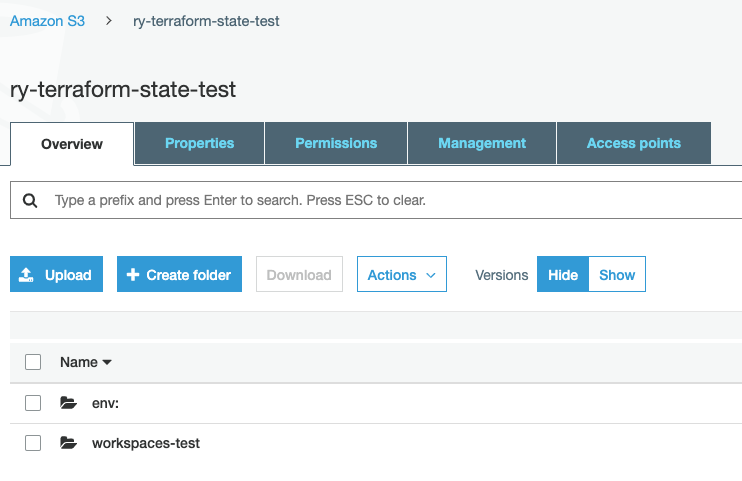
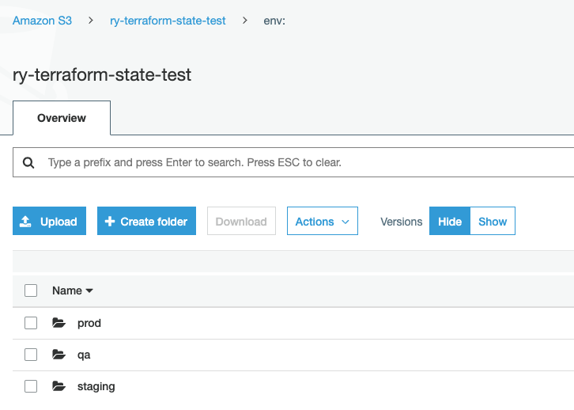

## Intro

This set up uses modules from the previous folder (vpc, instance, elb etc).

This set up is also to demonstrate how 

## Set up

```shell
// set up s3 and dynamo to store state
cd backend
terraform apply

// set up vpc
cd ../vpc
terragrunt workspace new dev // create new workspace
terragrunt apply

terragrunt workspace new prod // create new workspace
terragrunt apply

// set up web and high avail
cd ../services/web-server
terragrunt workspace new dev // create new workspace
terragrunt apply

terragrunt workspace new prod // create new workspace
terragrunt apply
```

## Outcome
- 2 vpcs, 2 elb, 2 asg (Names: `prac-002 - dev` and `prac-002 - prod`)

## Notes

### Terraform Workspace Commands
```
// other commands include: select, show, delete
terraform workspace new prod
```

### Tfstate files for different workspaces
State files for different workspaces will not override each other. Terraform will provision an `env;` folder in your state bucket and have top level workspace folders

For example:
```
// your directory structure
|-- terragrunt.hcl
|-- workspaces-test
    |-- backend.tf (generated by Terragrunt)
    |-- main.tf
    |-- terragrunt.hcl
```

The S3 bucket structure:




```
// your state bucket
|-- env;
    |-- prod
        |-- workspaces-test
            |-- terraform.tfstate
    |-- qa
        |-- workspaces-test
            |-- terraform.tfstate
    |-- staging
        |-- workspaces-test
            |-- terraform.tfstate
|-- workspaces-test (default)

```
