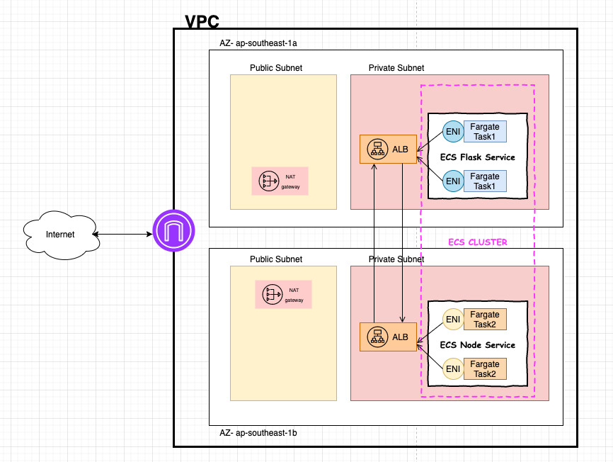

# Terraform Practice

## 001 - Running Nginx in AWS

Requirements:
1. Running Nginx in Docker in EC2.
2. Creating EC2 by Terraform.
3. We can access Nginx from the Internet.
4. Terraform state files should be saved in AWS S3. (nice to have)
5. Using the Terraform module to create EC2. (nice to have)

## 002 - Advanced 
Requirements:
1. Service-1 running in dedicated VPC.
2. Server-1 running in Private Subnet. (Cannot Access directly).
3. Server-1 should have High Availability(Load Balancer).
4. Server-1 EC2 has an Auto-Scaling Group.
5. It should have 2 Environments(Dev and Prod).
6. IaC is required.
7. Using Terragrunt instead of Terraform directly.

Solutions to multiple env:
1. Workspaces
```
|- vpc
    |- main.tf
|- web
    |- main.tf
```

2. Isolated env files
```
|- vpc
    |- dev.tf
    |- prod.tf
    |- shared.tf
|- web
    |- dev.tf
    |- prod.tf
    |- shared.tf
```

3. Isolated by folder
```
|- dev
    |- vpc
        |- main.tf
    |- web
        |- main.tf
|- prod
    |- vpc
        |- main.tf
    |- web
        |- main.tf
```


Note to self:
- When using data variable for ami from the net, check to use the correct version. Certain version may be imcompatible with whatever is in your user data
- When creating the ami from ec2, docker container will stop. When using launch config, user data should restart the container 
- specifying `remote_state` in root `terragrunt.hcl` file will autogenerate `backend.tf` in subfolders. If you have the `include` block in the `terragrunt.hcl` file in the subfolder
- Each folder is a separate terraform state. If you want to split up your resources, can. If you want to share the output of one terraform state with another, you have to either use `data` or `terraform_remote_state` but this won't work for outputs from modules.
- Using workspaces to denote environments
  * Can use `${terraform.workspace}` as the part of the name for variables
  * State files will all be stored in the same bucket, but under the env folder (separated by workspace name, as shown below) 
  * Cons: have to use same authentication and access controls
  * Cons: Not obvious what workspace you are in, may accidentally destroy resources in prod workspace thinking it was dev
- Using isolated files
  * Pros: it is faster to generate (don't have to change workspaces and apply, can just apply once)
  * Cons: Code is not DRY (provider, variables are declared once) - ok but the code is duplicated lol
  * Cons: Have to rename variables
  * Cons: Running terraform apply in the same folder may lead to accidental changes in prod

**UPDATE**:
- Use 003-modules/vpc for more concise and smaller cidr blocks
- Use ALB instead of Classic LB
- Have to add default security group to launch config and LB (intra-node communication) - see `002-modules/availability`
- Use `terragrunt apply-all` and `terragrunt destroy-all`
- Use SSM to handle ssh sessions (require iam policy and role), don't have to open port 22 anymore!
- Use dependency outputs with terragrunt
```terraform
// web/terragrunt.hcl
dependency "vpc" {
  config_path = local.vpc_path
}

inputs = {
  public_subnet_ids = dependency.vpc.outputs.subnets["public"]
  private_subnet_ids = dependency.vpc.outputs.subnets["private"]
  vpc_id = dependency.vpc.outputs.vpc_id
}
```
- Remember to specify type of variable (eg `type = list(string)`) else terragrunt inputs will read lists as string (cos thats how terraform reads TF_VARS)

## 003

Requirements:
[x] Service-2 running in another private subnet, same VPC with Service-1.
[x] Service-2 can call Service-1.
[x] Using Security Group to protect Service-1 and Service-2.
[x] Service-1 and Service-2 running on AWS ECS(Fargate or EC2).
[x] Enable logging(Log Groups) and monitor(Synthetics) for Service-1 and Service-2. maybe another monitoring tool
[x] Draw an architecture diagram before you create these resources(diagrams.net in Google Drive is an option).
(Opt) 6. Use SSM



Note to self:
* A special double-slash syntax is interpreted by Terraform to indicate that the remaining path after that point is a sub-directory within the package.
    - If your terragrunt source, also requires a module (using relative path), then have to use double slask to
     denote the root directory so that the relative path in the module will work properly
* ECS with fargate (fargate will manage ec2 instances)
  - [Fargate with task networking](https://aws.amazon.com/blogs/compute/task-networking-in-aws-fargate/)
* ECS with EC2 - may use ASG to define cluster
* Wanted to create a shared iam role for modules - unable to do conditional creation (terraform supports declarative style - should be explicit if resource is created or referenced)
* [Synthetics not out for terraform aws provider](https://github.com/terraform-providers/terraform-provider-aws
/issues/11145) -> could use other [monitoring tools](https://docs.aws.amazon.com/AmazonECS/latest/developerguide
/monitoring-automated-manual.html) for ecs
* Synthetics - creating a canary. Use vpc, private subnets and provide loadbalancer dns. It somehow just works. Creates a lambda function and ENIs => have to remember to delete them manually