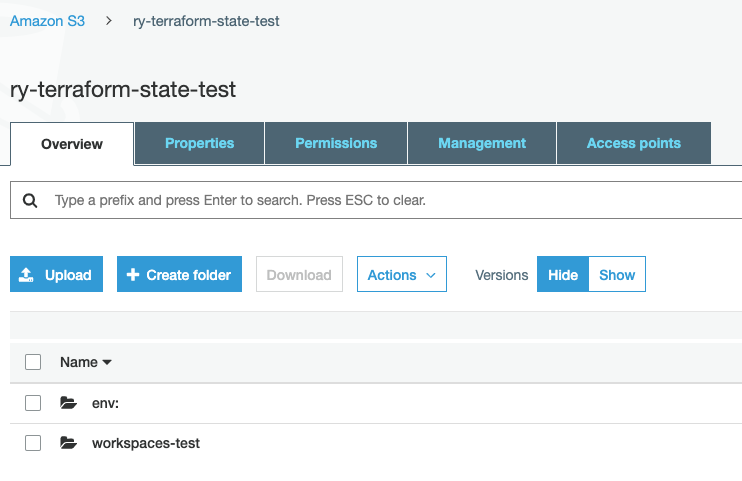
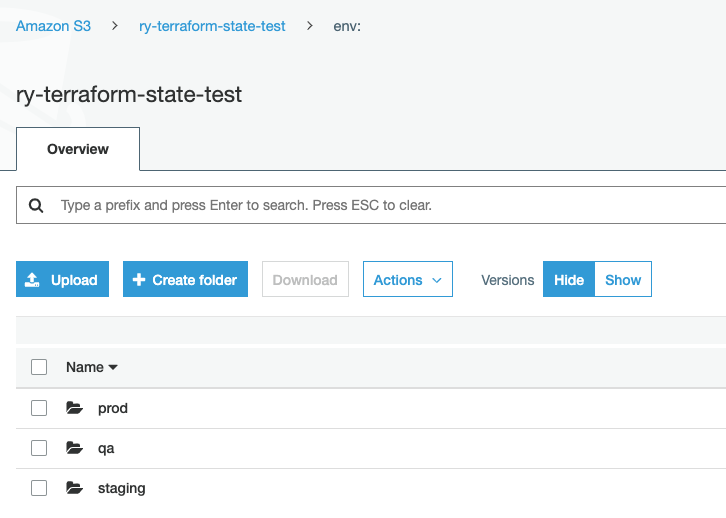

# Terraform Practice

## 001 - Running Nginx in AWS

Requirements:
1. Running Nginx in Docker in EC2.
2. Creating EC2 by Terraform.
3. We can access Nginx from the Internet.
4. Terraform state files should be saved in AWS S3. (nice to have)
5. Using the Terraform module to create EC2. (nice to have)

## 002 - Advanced 
Requirements:
1. Service-1 running in dedicated VPC.
2. Server-1 running in Private Subnet. (Cannot Access directly).
3. Server-1 should have High Availability(Load Balancer).
4. Server-1 EC2 has an Auto-Scaling Group.
5. It should have 2 Environments(Dev and Prod).
6. IaC is required.
7. Using Terragrunt instead of Terraform directly.

Note to self:
- When using data variable for ami from the net, check to use the correct version. Certain version may be imcompatible with whatever is in your user data
- When creating the ami from ec2, docker container will stop. When using launch config, user data should restart the container 
- specifying `remote_state` in root `terragrunt.hcl` file will autogenerate `backend.tf` in subfolders. If you have the include block in the `terragrunt.hcl` file in the subfolder
- Using workspaces to denote environments
  * Can use `${terraform.workspace}` as the part of the name for variables
  * State files will all be stored in the same bucket, but under the env folder (separated by workspace name, as shown below) 
  * Cons: have to use same authentication and access controls
  * Cons: Not obvious what workspace you are in, may accidentally destroy resources in prod workspace thinking it was dev

```
// other commands include: select, show, delete
terraform workspace new prod
```



```
// your directory structure
|-- terragrunt.hcl
|-- workspaces-test
    |-- backend.tf (generated by Terragrunt)
    |-- main.tf
    |-- terragrunt.hcl
```

If you use workspaces to create different workspaces (qa, staging, prod inside of workspaces-test)


```
// your state bucket
|-- env;
    |-- prod
        |-- workspaces-test
            |-- terraform.tfstate
    |-- qa
        |-- workspaces-test
            |-- terraform.tfstate
    |-- staging
        |-- workspaces-test
            |-- terraform.tfstate
|-- workspaces-test (default)

```
